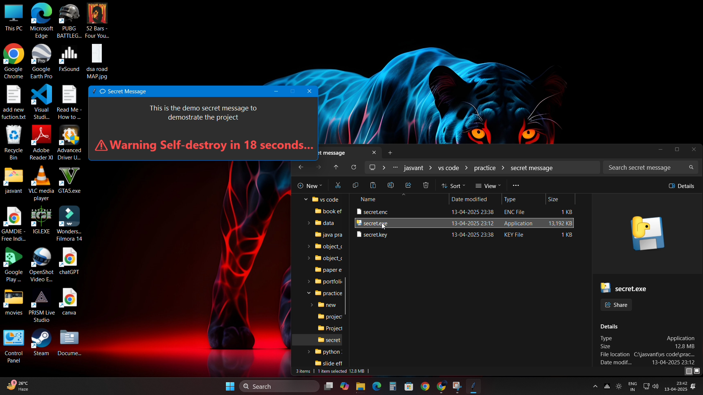

# 🕵️‍♂️ SpyPop – Secret Message Popup with Self-Destruct

**SpyPop** is a sleek Python project that encrypts secret messages and reveals them in a dramatic spy-style popup window. After showing the message, the app self-destructs — wiping out all evidence, including itself. 💥
This project is for **educational and demonstration purposes only**. It ensures privacy for temporary sensitive messages and securely removes them after viewing.


## 📁 Files

## 🧩 What This Tool Does

- `main.py` – Encrypts a secret message using `cryptography` and stores the result as `secret.enc` and `secret.key`.
- Decrypts a `.enc` (encrypted) message file using a `.key` file
- Displays the message in a styled GUI window (popup)
- Blocks attempts to close the window early
- Automatically deletes the message, key, and script/executable after countdown
- -✅ Only deletes project-related files, such as:
    secret.key
    secret.enc
    secret.py / secret.exe.
- No internet access or personal data collection
- -It.......:
    Does NOT access any user data
    Does NOT upload, share, or send files to the internet
    does not  access Documents, Photos, Desktop files
    does not  access Personal folders or system directories
##⚠️ Antivirus / Defender Notice

- These are false positives, and the source code is 100% open and inspectable.
- Please review the source if unsure before running the executable.


## 🚀 How to Use

### 1. first run main.py and give a secret message as input and it will genrate files which are as secret.enc and secret.key.
### 2. send secret.enc + secret.key + secret.exe or you can send  secret.enc + secret.key + secret.py to your friend or any user 

## ⚠️ Warning

### Once secret.py or secret.exe runs, it deletes itself and all related files. Use with caution — this is not reversible.

## Demo

🎥 [Watch the video here](https://drive.google.com/file/d/1cGmY1VHm9Gq3FvolqnIUvA6NN2xUCJU7/view?usp=sharing)

 <!-- Replace with your actual demo GIF or screenshot -->


## ⚠️ Disclaimer

This tool is created for educational purposes only.  
It does NOT access or harm personal files or send any data externally.  
It only reads and deletes files related to its own operation (`secret.enc`, `secret.key`, etc.).

However, since it includes self-deleting functionality and window restrictions, some antivirus software may flag it as suspicious.  
Run at your own discretion.

The source code is open and safe to inspect before compiling.


```bash
git clone https://github.com/jasvant0020/spypop.git
cd spypop


---

## 📄 License

This project is licensed under the [MIT License](LICENSE).
